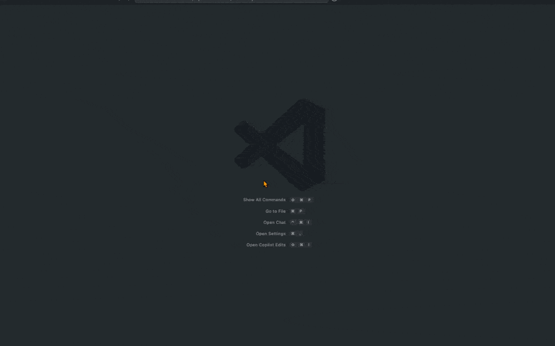

# 🚀 PR Prompt Generator

A VS Code extension that helps you generate prompts for AI tools (like ChatGPT) to write Pull Request descriptions based on your Git commit diffs.

It reads your `.github/pull_request_template.md` and combines it with commit changes to create a structured, easy-to-paste prompt.

## ✨ Features

- Automatically generates a PR prompt based on commit diffs
- Formats the prompt using your existing PR template
- Copies the prompt to your clipboard — just paste it into ChatGPT or your favorite AI tool!

## 📸 Demo

## 🛠 How to Use

1. Open the Command Palette and run:  
   `Generate PR Prompt from Commit Diff`
2. Enter the name of the parent branch (e.g. `main`)
3. The prompt will be copied to your clipboard!

## 💡 Requirements

- A `.github/pull_request_template.md` file must exist in your project root.
